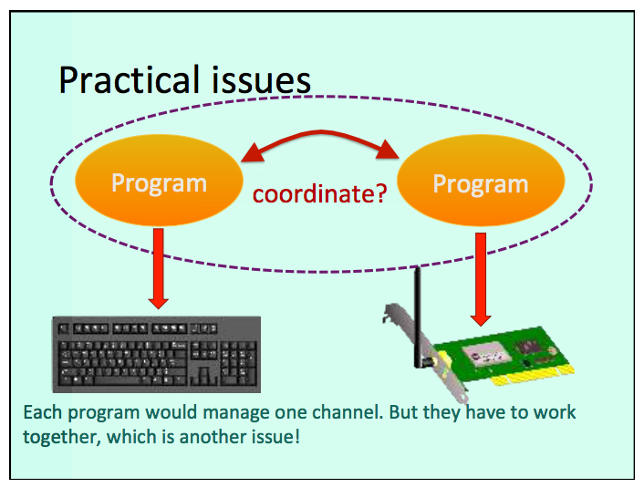
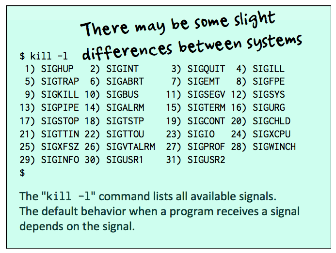
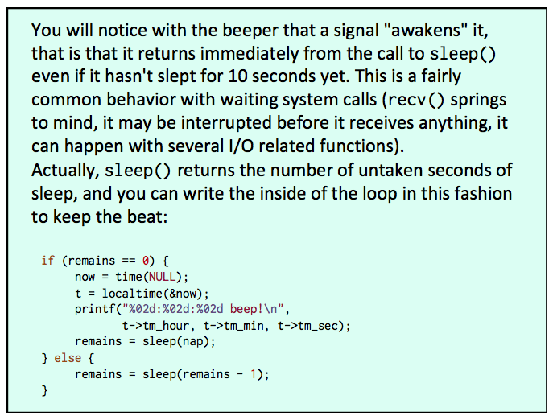
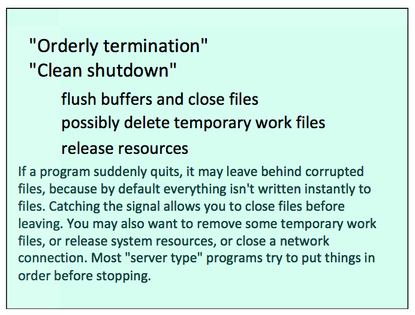

# Lecture 10

## Network Programming

### Principles

1. Get a socket id (int) with the `socket()` call

```c
include <sys/socket.h>
int socket(int domain,      //AF_INET, AF_INET6, AF_UNSPEC
            int type,       //SOCK_STREAM, SOCK_DGRAM
            int protocol);  // 0 - IP
```

Some of this information is usually specified in a special structure for network addresses.

```c
#include <netdb.h>
struct addrinfo {
  int ai_flags;     // AI_PASSIVE
  int ai_family;    // AF_SPEC
  int ai_socktype;  // SOCK_STREAM
  int ai_protocol;  // 0
  // Set everything else to 0
  socklen_t       ai_addrlen;
  char            *ai_canonname;
  struct sockaddr *ai_addr;
  struct addrinfo *ai_next;
}
```

Optional - Specify socket behavior

If your calls will block until something comes
on the network (the default), or return an error if there is no message.

```c
include <sys/socket.h>
int socket(int domain,
            int type, //SOCK_STREAM | SOCK_NONBLOCK
            int protocol);
```

2. Establish a connection using the `connect()` call

```c
include <sys/socket.h>
int connect(int socket,
            const strct sockaddr *address,
            socklen_t address_len);
```

The call needs a complicated structure with a lot of information you don't know.

This information is retrieved by the system from other servers or local files, based on what you provide.

```c
#include <sys/types.h>
#include <sys/socket.h>
#include <netdb.h>
int getaddrinfo(const char *hostname,
                // name or IP address
                const char *servname,
                // port (as string) or name
                const struct addrinfo *hints,
                // what we know (not much)
                struct addrinfo **res)
                // list found by the system
                ;
void freeaddrinfo(struct addrinfo *ai);
```

3. Call `send()` to send a message
4. If an answer is expected, call `recv()` or `read()` to wait for it
5. Call `close()` to end the connection

### What about writing a server?

```c
connect()
bind()
listen()
accpet()
```

### Turning it to C++

[TCP/IP Network Programming Design Pattens in C++](https://vichargrave.github.io/articles/2013-02/tcp-ip-network-programming-design-patterns-in-cpp)

- `TCPStream`
- `TCPConnector`
- `TCPAcceptor` (for writing a server)

Use `send()` and `recv()` rather than `write()` and `read()` as suggested in the post.

There are some errors in the test application (confuses `NULL` and `\0`).



**Multiple Threads**

### Hyper Text Transfer Protocol (HTTP)

A HTTP server is a program that waits for requests formatted in a special way and listens on port 80 (all browsers know that).

HTTP is a "high-level" protocol, messages that must have a certain format and are sent over TCP/IP.

## System Calls and Processes

Every process is identified by a process id (`pid`).

A process has easy access to two pids:
- Its own
- Its parent's

```c
#include <unistd.h>
pid_t getpid(void);   // pid of the current
pid_t getppid(void);  // pid of the parent
```

Every process except process 1 is created by another process!

`ps -o pid,ppid,time,comm`

```c
#include <stdlib.h>
// Create a subprocess that runs the command
int system(const char *command);
// Waits for command completion
// Returns the return code of the command
```

### Signals

```c
#include <signal.h>
int kill(pid_t pid, int sig);
/*
  pid
    > 0   specific process
    0     processes in the same group
    -1    other processes of the same user
*/
```

`kill -l` lists all available signals.

**Special signal**

`0` = test if process is alive



> signal 0 is a dummy signal which isn't delivered to the "target", but allows the sender to know whether the process corresponding to the pid is up and running.

#### Signal handler

`void handler(int sig)`

In some systems, handlers are automatically deactivated after being called. **Must reset themselves.**

`SIGKILL` and `SIGSTOP` cannot be caught or ignored

```c
#include <signal.h>
sig_t signal(int sig,
            sig_t func);  // SIG_IGN - Ignore,
                          // SIG_DFL Default behavior
// Returns previous settings
```

> The hard way to trap a signal is calling the `sigaction()` function which, also declared in the same `signal.h` as `signal()`, is documented in section 2 (system calls) of the manual.

> `sigaction()` allows for finer handling of signals than `signal()` can. For instance, nothing prevents with `signal()` a handler from being itself interrupted while processing a signal. Function `sigaction()` allows to mask interrupts and work uninterrupted when needed, and so forth.

Return from handler:

Resume but not always exactly where interrupted (eg system calls)

> possible to return to a given instruction (`setjmp()` / `longjmp()`)





**beeper.c**
```c
#include <stdio.h>
#include <stdlib.h>
#include <unistd.h>
#include <signal.h>
#include <time.h>

#define SLEEP_TIME  5

int        nap = SLEEP_TIME;

void handler(int sig) {
   nap /= 2;
   if (nap < 1) {
     nap = 1;
   }
}

int main() {
    time_t     now;
    struct tm *t;
    int        remains = 0;

    signal(SIGINT, handler);
    signal(SIGTERM, handler);
    while (1) {
       if (remains == 0) {
         now = time(NULL);
         t = localtime(&now);
         printf("%02d:%02d:%02d beep!\n",
               t->tm_hour, t->tm_min, t->tm_sec);
         remains = sleep(nap);
       } else {
         remains = sleep(remains);
       }
    }
    return 0;
}
```

#### How to get the process id of an unrelated process?

`popen()` (pipe open) allows you to open a command as if it were a file, and to directly read from its standard output.

To check a single program

`ps -e -o pid,command | grep prog | grep –v grep`

### Starting subprocesses

- `system()` serializes
- `popen()`  strong link

- Simulations
- Parallel processing
- Daemon (session independent)

`fork()` = clone me

```c
#include <unistd.h>
fork() // Takes no arguments, returns a pid_t
// -1 if error, 0 if child, child pid if parent
```

The forked process will be identical in every respect, except for pid and parent pid. It will run the same code, write to the same files and the same terminal.

SAME `stdin` / `cin`, `stdout` / `cout`, `stderr` / `cerr`

- Child dies:

parent receives `SIGCHLD`

- Parent dies:

process #1 becomes foster parent

A parent process is expected to wait for the completion of the child process.

> The reason is that a process returns a status (the int return value) and that this status is supposed to be at least acknowledged by the parent process. As long as the status isn't acknowledged, the system cannot quite cleanup everything related to the completed process.


...
