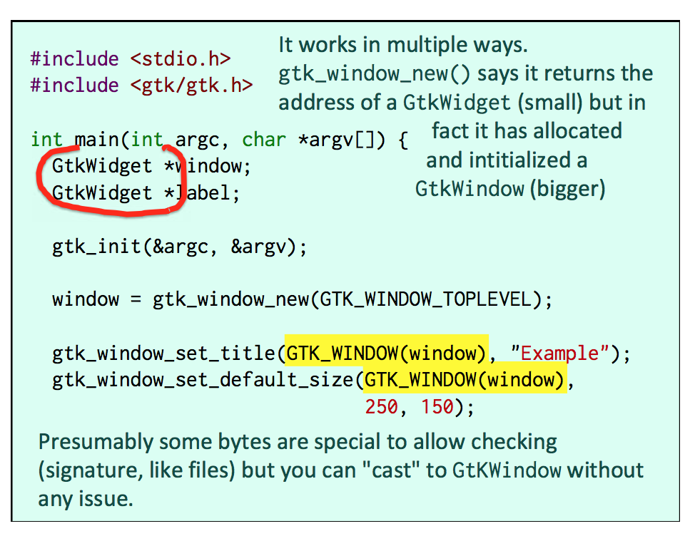
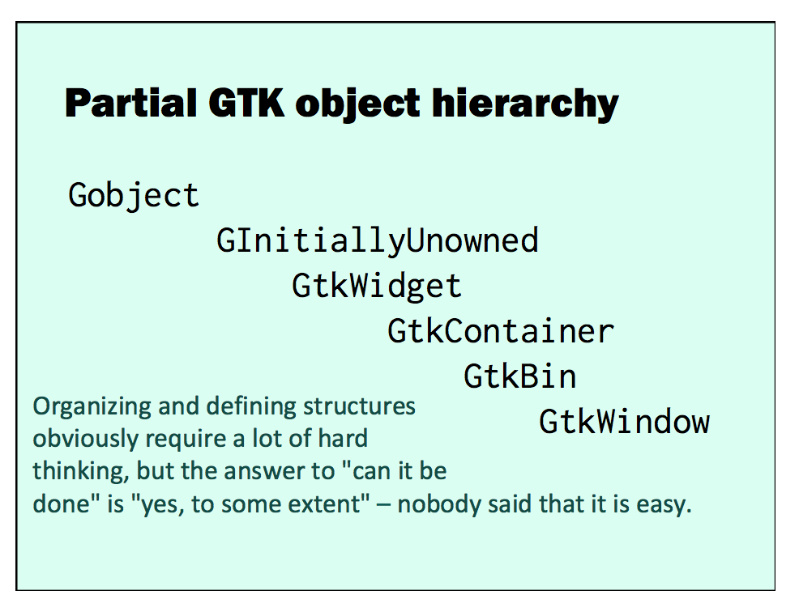

# Lecture 11

A parent process is expected to wait for the completion of the child process.

> The reason is that a process returns a status (the int return value) and that this status is supposed to be at least acknowledged by the parent process. As long as the status isn't acknowledged, the system cannot quite cleanup everything related to the completed process.

`wait()` function

```c
#include <sys/wait.h>
// Wait for any child (its pid is returned)
pid_t wait(int *stat_loc);
// Wait for a specific child
pid_t waitpid(pid_t pid, int *stat_loc, int options);
```

Process #1, the foster parent of all orphaned processes, does nothing but waiting.

## ZOMBIE

A not-waited for process

## What about starting a different program?

First the program clones itself. This provides a "shell".

Then the child program calls the "exec()" function that loads and starts running the code for a completely different program.

```c
int execl(const char *path, const char *arg0, ..., NULL);
int execv(const char *path, char *const argv[]);
// argv[]: First element = path, terminated by NULL
```

`char *getenv(const char *name);`

allows you to retrieve the value of any environment variable.

## Daemon

Launching an independent program

Problems to solve:

- not attached to a terminal
- parent won't wait for it
- environment (directories, etc.)

### Creating a daemon

`daemon()` function turns a process into a system service.

```c
#include <stdlib.h>
int daemon(int nochdir, // if 0 moves current directory to /
          int noclose); // if 0 redirects stdin, stdout
                        // and stderr to /dev/null (aka "black hole")
```

If `daemon()` not available:

- Need to fork TWICE
- Create a new session (`setid()`)
- Deal with opened file descriptors

**Search the web!**

## Inter-Process Communication (IPC)

The first two ones can really be used for transmitting information, the third one is for synchronization.

- Messages
- Shared Memory
- Semaphores

### Messages

basically a shared **queue**, where processes can add and remove messages.

### Shared Memory

Shared memory allows mapping in the private address space of a process a memory area that simultaneously appears in the address spaces of several processes;

### "Shared Key"

SHARING a message queue or memory area requires that several processes use the same identifier for it.

- cannot be random
- uniqueness issue

`key_t` integer

`key_t ftok(const char *path, int id);`

generates a suitable shared key


### Sharing Messages

```c
#include <sys/msg.h>
key = ftok("/etc/supersoft.conf", 'q');
msqid = msgget(key, 0666 | IPC_CREAT);
```

a struct `msgbuf` must contain a long as first member, but the second member can be anything

```c
struct msgbuf {
     long mtype;  // Must be positive
     char mtext[1]; // dummy
};
int msgsnd(int msqid, const void *msgp,
            size_t msgsz, int msgflg);
// msgsz excludes mtype
int msgrcv(int msqid, void *msgp,
            size_t msgsz,
            long msgtyp, int msgflg);
/*
  msgtyp:
    0:  get next message
    >0: get next message of this msgtyp
    <0: get next message with msgtyp < abs(arg)
*/
```

#### Deleting a message queue

`msgctl(msqid, IPC_RMID, NULL);`

When you are done with a message queue, you must delete it.

In console: `ipcrm`

This is usually done by the parent process when all subprocesses have terminated.

### Sharing Memory

Key required, you request a shared memory segment of a given size and get a dynamic identifier, then `shmat()` returns a pointer to it, `malloc()` style.

```c
key_t key;
int   shmid;
char *data;

key = ftok("etc/supersoft.conf", 'm');
shmid = shmget(key, 1024, 0644 | IPC_CREAT);
data = shmat(shmid, (void *)0, 0);
```

> You can pass a not NULL pointer if you want the shared memory to be mapped to a specific address. I have never found any use for this feature so far.

`(void)shmdt(data);`

When you are done you unmap (detach) shared memory from your space.

When all processes have detached with shmdt() from the shared memory area, the segment is still there.

`shmctl(shmid, IPC_RMID, NULL);`

Problem: Concurrency

Solution: Semaphores

### Semaphores

```c
#include <sys/sem.h>
int semget(key_t key, int nsems, int semflg);
// You are usually asking for nsems distinct semaphores,
// each one protecting a distinct variable or structure
// in shared memory.
```

Must be initialized with a call to `semctl()`

- When a program needs access to a resource, it will specify the id of the semaphore set, then the number of the specific semaphore associated with the resource, and say it wants to decrement the counter by 1. If the counter is one, this will be possible, the operation is guaranteed to be one- process-at-a-time, the process will grab the resource and the counter will become 0.
- Another process doing the same request a fraction of a second later will block, as the counter is 0.
- When the first process is done, it releases the resource by adding one to the semaphore.
- Then the second process is unblocked and can grab it, and so forth.
- Sometimes a bit difficult to tune, especially deciding what are the right initial values.

```c
struct sembuf {
    ushort sem_num;
    short  sem_op;
    short  sem_flg;
};
/*
  sem_op:
    >0: add to semaphore counter (release)
    <0: block until it can be subtracted from semaphore
        counter (grab)
    0:  block till counter is zero
    ??? What are the differences? ???
*/
```

`semop()` is the blocking call.

```c
int semop(int semid,
          struct sembuf *sops,
          unsigned int nsops);
```

#### Destroying semaphores

`semctl(semid, 0, IPC_RMID);`

Note that here `IPC_RMID` is the third parameter, the second one is a semaphore number only used for other operations.

## POSIX threads

Lght-weight processes that don't do the heavy lifting of `fork`/`exec`.

- lightweight processes
- No `fork`/`exec`
- start a function rather than a program
- Concurrency issues with global variables

## Pure C++

#### Don't use `using namespace xxx;` in header files.

Name conflict

There is a "global namespace" just indicated by `::`

#### Short-cut for initializing attributes

You can initialize values in a constructor by giving, between the name of the constructor and its body, the name of the member attribute(s) with the value to set.

```cpp
<constructor>: attr_name(value), ... {
}
// The general syntax:
Class::Class(parameters):attr1(val1), attr2(val2)... { ...
}
```

## Inheritance

deriving a class from another class

```c
Class::Class(parameters) : ParentClass(), attr(val)... { ...
}
```

Inheritance is about **being**, not about having, and means shared DNA.

### 1. Implementation

Implementation refers to how things are done (`interface` in Java).

```
<Class name> is implemented as a <Class Name>
```

eg. `Stack` can be implemented in different ways: `Array`, `LinkedList`

There are other ways to do it (`aggregates`, I'll discuss them later)

### 2. Being

```
<Class name> (Specialized) is a <Class Name> (General)
```

Derived classes don't see what is private.

```cpp
private:
  friend:
protected: // Visible by derived class
public:
```

### Object Assignment

**Rule:** Assignment only works if ALL objects on the right hand side are objects on the left hand side. (Only if **public inheritance**)

```cpp
TravelService  s;
TravelService *sptr;
CarRental      c;
sptr = &c;  // Reverse fails
s = c;      // CAREFUL!
/*
  Assignment works with pointers and references,
  not necessarily objects.
  Using a Clone constructor (that takes a reference)
  will be safe, though.
*/
s = TravelService(c);
```

```cpp
class A { ... };
// public inheritance
class B : public A { ... };
// protected inheritance
// What is public in A becomes protected in C
class C : protected A { ... };
// private inheritance
// What is public in A becomes private in D
class D : private A { ... };
```

- method overloading (different parameters)
- method overriding (same parameters)
- method hiding (same name)

Notice that, for method overriding, not the same behavior as Java as C++ is serious about data types.

### `virtual method`

May be overridden by a derived class.

> If you say that a method is "virtual" in a class, that means that you expect the method to be overriden (same name and parameters) in a derived class. It doesn't prevent you from implementing it in the parent class!

### `Abstract Class`

Must be derived

All constructors `protected` OR `virtual method() = 0;`

Initializing at least one virtual method to 0 forces the class to be abstract.

### Multiple inheritance

```c
Superman::Superman(parameters) : Bird(), Plane() { ...
}
```

### Aggregate


```cpp
class Awacs:
        Aircraft{
  Radar rad;
};
class Awacs:
        Radar {
  Aircraft carrier;
};
class Awacs {
   Radar    rad;
   Aircraft carrier;
};
```

### Is inheritance possible in pure C?

You can come very close.

```c
struct parent_t {
   ...
};
struct child_t {
   struct parent_t parent;
   ...
};
```

`struct parent_t *p`

`struct child_t *c`

In memory, the parent data will be at the beginning of the memory area.

`struct parent_t *p = (struct parent_t *)c;`

You'll simply ignore what is specific to the child object.






OK, you **cannot derive your own objects**, but you can build from scratch a hierarchy of "objects".

> Nothing in C allows you to say that a structure derives from another structure (other than nesting them): inheritance is "by hand" and a bit rough around the edges. However, once your hierarchy is in place, you can use it in a very interesting way.

## Exceptions: Different Errors

Errors:

- Compile-time
- Link-time
- Run-time
  - Detected by the application
  - Detected by the library (**Exceptions !!!**)
  - Detected by the Operating System
- Logic

Exceptions have been designed to have the library catch errors in a running program before the Operating System sees them (and delivers a lethal signal to the offending program).

### Built-in Exceptions

There are many built-in exceptions in C, all deriving from `std`.

What is called `logic_failure` is a logic error from a C programming standpoint, not from an application standpoint.

`std::exception`
- `std::bad_alloc`
- `std::bad_cast`
- `std::bad_typeid`
- `std::bad_exception`
- `std::logic_failure`
  - `std::domain_error`
  - `std::invalid_argument`
  - `std::length_error`
  - `std::out_of_range`
- `std::runtime_error`
  - `std::overflow_error`
  - `std::range_error`
  - `std::underflow_error`

### User-Defined Exceptions

Usually defined as embedded classes (classes in classes).

Avoids name conflicts.

Each exception that can occur is defined as an inner class. The full exception name is qualified by the outer class name.

```c++
class Outer {
public:
  class Inner {
    // Inner declarations
  };
// Outer declarations
};
Outer outerObject;
Outer::Inner innerObject;
```

#### Define an exception for `MyClass`

```c++
class MyClass {
public:
  class Error : public exception {
  public:
    virtual const char * what(void) const throw () {
      return "Hopefully meaningful message";
    }
  };
  ...
};
```

### Trigger an exception with `throw`

You throw an object, not a type.

#### `throw Error();`

The parentheses after `Error()` mean that we instantiate an `Error` object on the fly when we throw the exception.

To catch the exception we must give the full exception name.

Optionally (with unrecoverable errors) we may want to propagate the exception "upwards" after emergency surgery, and throw it again.

```c++
catch (MyClass::Error & e) {
  cerr << e.what() << endl;
  // Specific processing
  throw; // Optionally propagate
}
```

```c++
```

Working with exceptions require having clear ideas not only about the "good path" (the program flow when everything works fine) but also the "bad path" (where and when you handle problems that can be expected or unexpected).

The "bad path" is often skipped over, yet it's very important for two reasons:

1. **Assessing** whether the error is recoverable and if the program can continue.
2. **Returning enough information** to developers so that they know where and why the problem happened.

#### NEVER IGNORE THE UNEXPECTED

> Many developers frequently catch a number of exceptions than they know can occur and handle them, then say "whatever else happens, ignore it". This is a big mistake.

At the least, any unexpected exception should be thrown. Ideally, it should be **written to an error log** (so that you know where it was detected), then thrown.

### Exception propagation

What if a thrown exception isn't caught, or is thrown from level to level without being processed? It's always caught at the `main()` level and causes program termination.

The snag is how it is done, because the default function that terminates the program is a dirty, panicky quitting.

`main()` calls `terminate()` to abort.

#### `set_terminate()`

You can do better by creating a function that calls the standard `exit()` function that attempts to quit cleanly (closing opened files, etc.)

This function can be "installed" by calling `set_terminate()` at the beginning of the
program.

```c++
void farewell(void) {
  cerr << "Unhandled exception" << endl;
  cerr << "Clean program termination" << endl;
  exit(1);
}

int main(int argc, char **argv) {
  set_terminate(farewell);

  // Presumably useful code

  return 0;
}
```


...
