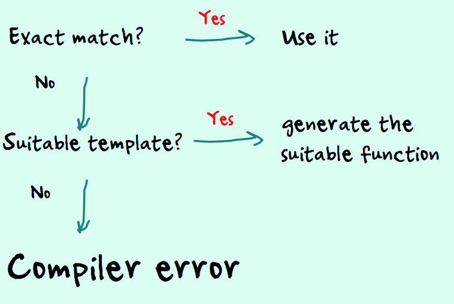

# Lecture 12

## Types

### C

C-style "data genericity" uses pointers that C has to blindly believe to be what t-you say. The compiler can check nothing (it moderately trusts you).

Whatever you are calling it, `char *`, `unsigned char *` or `void *`, it's pretty much the same.

- No semantic check
- Debugging painful
- Low productivity

> Needless to say, the compiler, having no real idea about what you are trying to do, won't be able to warn you about misuse. Once your program compiles, you can brace yourself for crashes and long, painful debugging.

Here is Stroustrup's answer to these issues.

## C++ Templates

Typing is important to Stroustrup. `void *` is nightmarish in this respect.

**C++ Goals**

- Code once
- Reuse the software component many times
- Strong typing to find errors early


Function overloading is nice but very often you need to write overloaded functions that are basically the same code. If a function takes a float argument, you can pass an integer, it will be automatically converted.

```c++
float average(float *arr, int n) {
  float total = 0;
  for (int i = 0; i < n; i++) {
    total += arr[i];
  }
  return total / n;
}
```

However, **overloading doesn't work with pointers**, and therefore arrays. The compiler won't let you pass an int array to this function, you need to overload it with the same thing except the type of the first parameter.

#### Using preprocessor

One way to work around this would be to **use the preprocessor** (using `typedef` would also be possible), have a generic "type", and substitute whatever you need.

```c++
#define THINGY   float

float average(THINGY *arr, int n) {
  float total = 0;
  for (int i = 0; i < n; i++) {
    total += arr[i];
  }
  return total / n;
}
```

**Problem**: if in the same code you need to average both an `int` and a `float` array.

#### Templates: Compiler with kind of preprocessor abilities

only better.

You create a "template" with a generic class, and the compiler will use it to generate a full series of overloaded functions without your having to write anything else.

```c++
template<class T> float average(T *arr, int n) {
  float total = 0;
  for (int i = 0; i < n; i++) {
      total += arr[i];
  }
  return total / n;
}
```

##### `typename`

As some people were finding "class" a bit ambiguous in this context (it also applies to plain C types, that's a difference with Java), `typename` can be used instead.

```c++
template<typename T> float average(T *arr, int n) {
  float total = 0;
  for (int i = 0; i < n; i++) {
      total += arr[i];
  }
  return total / n;
}
```

When you compile, the compiler will first look for a suitable function, and if none is found may be using a template.

<p align="center"></p>

**Efficient**: The compiler generates as many versions as
needed.

Template necessarily in a header file (not real code).

### Different mechanism from Java

- Java generics only work with objects
- The Java compiler adds casting

One limitation is that you need to work with references, and you cannot in Java use base types in templates.

- Java can do a runtime check (more flexible)
- C++ must check when compiling (faster)

### Limitations

Templates no longer works, though, when types no longer match **exactly**.

C usually doesn't scoff at passing a `char` where an `int` is expected; conversion is automatic. It won't work with a template though;

```c++
template <class T>
T max(T a, T b) { return (a > b ? a : b); }
char c;
int i, j;
j = max(i, c); // This won't work
```

You can create a template with two parameterized classes, and this would work (however, the first parameter still has to be the same type as the returned value). It would also work with twice the same class.

```c++
template <class T, class U>
T max(T a, U b) { return (a > b ? a : b); }
char c;
int i, j;
j = max(i, c);
```

### Generic tree, C-style

> C can do it, as long as you remain at the byte level with addresses "in memory". You end up with `void *` and `void **` pointers, the compiler has no way to check whether you aren't pointing at the right type, and if using an undefined byte address is a powerful tool it's not one to put in the hands of an inexperienced developer.

- Node is a pointer to the key of the node.
- Cast to a double pointer to the data type stored in the tree.
- Use double indirection to retrieve the original key value.

It will probably compile, or crash when running and it will take an awful long time to debug.

#### Other option: `struct`

```c
typedef struct node {
  // data here
  struct node *left;
  struct node *right;
} NODE_T;
```

#### `template`

A template may be a way to solve it (often, together with inheritance) if you manage to insulate tree from content management.

```c++
template <class T> class BinaryTree {
private:
  struct node {
    T     m_data;
    node *m_left;
    node *m_right;
  };
  node *m_root;
  int   m_node_count;
public:
  // ...
}
// ;
```

Comparison can be a problem!

```c++
bool operator< (T & other) {
  return(data < other);
};
```

You may have to redefine comparison operators for walking a tree (if you use C char arrays, you may want to redefine `operator<()` with `strcmp()` for instance)

```c++
// You can also turn the stack size
// into a template parameter.
// As with function parameters,
// you can provide a default value.
template <class T, int Max = 10>
class Stack {
private:
  T   _s[1+Max];
  int _sp;
  int _max;
public:
  Stack() _max(Max), _sp(0) {}
  void push(T x) {_s[_sp++] = x;}
  T pop(void) {return _s[--_sp];}
  int isFull(void) {return _sp == _max;}
};
// declaration:
Stack<int> S;
// or (often preferred):
typedef Stack<int> IntStack;
IntStack S;
```

### Template specialization (= overriding)

In the same way you can override a parent method in a derived class, you can **override a template and provide a special version**.

```c++
template <class T>
class SomeClass {
  // ...
}
// ;

template <>
class SomeClass<char> {
  // Redefine or extend
  // ...
}
// ;
```

## Standard Template Library (STL)

Alexander Stepanov (1950 - )

The STL is about "generic programming".

- Containers
  - classic data structures
  - `vector<T,Allocator>`
  - `list<T, Allocator>`
  - `deque<T, Allocator>`
  - stacks and queues
  - set, map, hashmap
- Iterators
  - Several types of iterators have been defined for exclusively reading data or writing it, moving forward and either reading or writing, moving in both directions or directly jumping to locations
  - 5 types: R, W, `->`, `<-`, `<->`
- Algorithms
  - Search, Sort
- Functors
  - also known as "function objects"

### Functor

Function call operator `operator()`

Object callable as a function

A "functor" is simply an object that can be called as a function.

The requirement is that it redefines the "function call operator", which as a method is simply called `operator()`.

#### Why a function object?

Because of **attributes**. Attributes allow you to have a "context" .

If you want to write a simplified version of `strtok()` that takes a single char as separator, you end up with something very similar to what `strtok()` must look like, with a static pointer to remember your position in the string.

```c++
char *simple_strtok(char *str, char sep) {
  char *p = NULL;
  static char *q;

  if (str != NULL) {
    p = str;
    q = p;
  } else p = q;
  if (p == NULL) return p;
  while (*q && (*q != sep)) q++;
  if (*q == '\0') q = NULL;
  else *q++ = '\0';
  return p;
}
```

**Problem**: One string at a time!

It works well with a single string, but sometimes you need to tokenize several strings in loops.

**Solutions**

##### 1. Classic C solution

> No longer have a static pointer in the function, but to pass to the function a pointer on the pointer so that it can be modified. The caller keeps a
context for each call.

Pass `q` as a `char **` to the function and keep one pointer per string.

`char *strtok_r(...)`

`char *strsep(...)`

> It's recommended to use `strsep()` rather than `strtok()`

##### 2. Use a functor

> As every time we tokenize a new string we can instantiate a new functor, keeping the memory of where we are in the string (so far done with a static variable) can be done by an attribute that belongs to one specific functor.

I'm going to create a tokenizer class, that uses another STL template, a `vector`, which is nothing more than an array that grows automatically when needed.

Method `c_str()` extracts from a C++ string the classic C `\0` terminated array of chars.

And to turn my tokenizer class into a functor, I need to redefine `operator()` that looks very much like `simple_strtok()` except that the former static pointer is now an attribute of the class.


```c++
#include <iostream>
#include <vector>
using namespace std;
class tokenizer {
private:
  vector<char> _str;
  char *_p;
  char *_q;

public:
  tokenizer(string str):_p(NULL) {
    _str = vector<char>(str.c_str(),
                        str.c_str() + str.size() + 1);
  }
  string operator()(char sep) {
    if (_p == NULL) {
      _p = &(_str[0]);
      _q = _p;
    } else _p = _q;
    if (_p == NULL) return "";
    while (*_q && (*_q != sep)) _q++;
    if (*_q == '\0') _q = NULL;
    else *_q++ = '\0';
    return string(_p);
  }
};
int main() {
  string tok;
  string tok2;
  int i = 1;
  tokenizer next_token("2016|Mei ren yu|The Mermaid,美人鱼|cn|Stephen Chow(D),Deng Chao(A),Lin Yun(A),Luo Show(A),Zhang Yuqi(A)");
  tok = next_token('|');
  while (tok.length() > 0) {
    cout << "Field " << i << endl;
    tokenizer next_token2(tok);
    tok2 = next_token2(',');
    while (tok2.length() > 0) {
      cout << " " << tok2 << endl;
      tok2 = next_token2(',');
    }
    tok = next_token('|');
    i++;
  }
  return 0;
}
```

**Don't confuse constructor invocation and function call.**

Beware that syntax is confusing, as when you instantiate and initialize a new object it looks a lot like calling the functor.

- Constructors are always preceded by the class name.
- Function calls assign a result to a variable.

You may find calling the constructor explicitely easier to understand.

`tokenizer next_token2 = tokenizer(tok);`

### Objects

- Harder to design well
- Easier to work with

## C++ style cast

`static_cast<type>(expression)`

`const_cast<type>`

## Great resource

Warmly recommended.

**Programming in C++ Rules and Recommendations (1992)**

## Persistence in C/C++

Persistence in C or C++ is **mostly storing on disk what you would keep in memory**, either because what you have to manage is too big to entirely fit in memory, or for safety reasons (you don't want to lose anything if the computer crashes - messaging systems have this problem).

### Serialization

[Boost library](http://www.boost.org)

A rather well known free C++ library implements, among other features, Java-style serialization.

Or add your own `save()` and `restore()` methods.

### Files

#### Safety Issue

`fread()`

For instance on a Unix-like system for performance reasons input/output operations are buffered. Most of your "disk" reads are from memory.

`fwrite()`

Operating System: `fflush()` `fclose()`

Same story with writes, which are usually asynchronous unless you "force" them. If the system crashes after a write but before a flush, data may be lost.

So you have to decide where to put the cursor between safer applications that flush every write to disk, and (much) faster applications in which what is in volatile memory
may be lost.

#### Accessibility Issue

`fseek()`

Assumes same sized records and/or directory of records.

> There is (apart from reading the full file) no other way to look for data into a file than `fseek()`, which is just going to an offset expressed in bytes. Except for the uncommon case when all records are the same size and you know which one you want, it requires additional data structures (in memory?) to tell you where to find what you want. Data structures that have to be maintained too.

`mmap()`

System call, maps a file in memory

> Allows you to move around in the file using pointers rather than `fseek()`, even if it's still the same "byte offset" logic.

### Key/Value stores

Associate with a "key" (which can be anything, including a string) a "value" (anything too).

There is in C a number of functions to deal with a file-based key-value store, all described in `ndbm.h`

```c
typedef struct {
  char *dptr,
  int dsize;
} datum;
```

These functions use a `datum`, a small structure that basically describes bytes to store whatever you want.

Key is a `datum`, Value is a `datum`

- No semantic check
  - "semantic" means "meaning"
- Debugging painful
- Low productivity

> Key/Value stores are an extremely primitive way of storing data. You cannot force a consistency check (for instance to say for employees that if the birthdate is greater than the hiredate, there must be a typo ...).

> Combining data from various sources is as difficult as working with arrays.


```c++
#include <ndbm.h>
DBM *dbm_open(const char *file,
              int open_flags, mode_t file_mode);
void dbm_close(DBM *db);
int dbm_store(DBM *db, datum key,
              datum content,
              int store_mode);
datum dbm_fetch(DBM *db, datum key);
datum dbm_firstkey(DBM *db);
datum dbm_nextkey(DBM *db);
int  dbm_delete(DBM *db, datum key);
```

- No comparison defined
  - byte equality
- No range query
  - You need to loop over everything.
- Works on single elements

### Distributed Files

Latency is quite noticeable between continents. Too many exchanges kill performance.

### Relational databases

#### ACID

- Atomic
- Consistent
- Isolated
- Durable

#### SQL

SQL (Structured Query Language) is ubiquitous but every database management system has its own variant.

#### CONSTRAINTS
- Data type
- Mandatory or not
- Check Uniqueness
- Reference

#### Modelling harder than with Objects

With very careful modelling you may present the same data in very different ways and have good performance in all cases.

- Tables are NOT classes
- Rows are NOT objects
- "Impedance mismatch"
- Think in sets
- Minimize DB accesses

> You don't loop in SQL, you state what you want. You should try to get data in one query, not mix program logic with SQL.

#### Object Relational Mapping

Database language (SQL) transparently generated.

> Those tools, usually written by people with a limited grasp of databases, work well in very simple cases, but you reach their limits very fast. Most professional developers spend a lot of time writing database queries.

#### Accessing a database from a C program

- Database Connection
- Statement
- Associate parameters
- Execute a query
- Loop on rows returned

### Embedded databases

- No server, single-user
- "Connection" same as opening a file
  - > a real server requires authentication (for instance providing a username and a password)
- Everything else like the real thing
  - Data is stored in tables that are queried using SQL.

#### SQLite

[Website](www.sqlite.org)

- Public domain
- One file to download
- Used in mobile apps – and by Mozilla
- Several free tools exist for exploring the "database"

Copy to current work directory

`sqlite-amalgamation-xxxxxxxx.zip`
  - `sqlite3.c`
  - `sqlite3.h`

#### Example

##### SQL Query

```sql
select c.country_name as country
         count(*) as films
  from movies m
       join countries c
on c.country_code = m.country
where c.continent = <continent name>
group by c.country_name
order by c.country_name
```

##### 1. Database Connection

- `sqlite3_open()`

```c
// 1. Declare, used like a FILE *
sqlite3 *db = NULL;
// 2. Call sqlite3_open() with &db
int sqlite3_open(
  const char *filename, /* Database filename (UTF-8) */
  sqlite3 **ppDb        /* OUT: SQLite db handle */
);
```

returns `SQLITE_OK` or an error code

This function rarely fails with SQLite, the file is created if it doesn't exist.

- `sqlite3_close(sqlite3 *db);`

##### 2. Statement

- `sqlite3_prepare()`

```c
// 1. Declare
sqlite3_stmt *stmt = NULL;
// 2. Call with &stmt
int sqlite3_prepare(
  sqlite3 *db,            /* Database handle */
  const char *zSql,       /* SQL statement */
  int nByte,              /* pass - 1 */
  sqlite3_stmt **ppStmt,  /* OUT: Statement handle */
  const char **pzTail     /* NOT IMPORTANT*/
);
```

returns `SQLITE_OK` or an error code

It may fail if SQL is wrong.

- Bind parameters

```sql
select c.country_name as country
         count(*) as films
  from movies m
       join countries c
on c.country_code = m.country
where c.continent = upper(?)
group by c.country_name
order by c.country_name
```

- `sqlite3_bind_xxx()`

`sqlite3_bind_text()`
`sqlite3_bind_int()`
`sqlite3_bind_double()`

To associate a value with the parameter, we must call a `sqlite3_bind_xxx()` function for every parameter in the query.

```c
int sqlite3_bind_<type>(
  sqlite3_stmt *stmt,
  int pos,            /* Number of the ?, starts with 1 !!! */
  <type> value,       /* value supplied */
  ...                 /* depends on type */
);
```

Returns `SQLITE_OK` as usual when it succeeds.

- Execute statements

`int sqlite3_step(sqlite3_stmt *stmt);`

What is returned depends on SQL command.

- `create`, `alter`, `drop`, `insert`, `update`, `delete`
  - `SQLITE_DONE` or an error code

> Those statements modify the database, but don't return any data (although a function is available to get how many rows were modified).

#### Compile

- If you have downladed SQLite:

`$ gcc -c sqlite3.c -o sqlite3.o`

`$ gcc -o sqlite_prog sqlite_prog.c sqlite3.o`

- If you are using the version on your system:

`$ gcc -o sqlite_prog sqlite_prog.c –lsqlite3`

...
