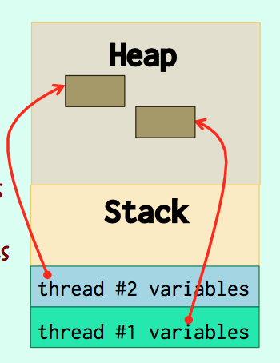

# Lecture 13

## Object Oriented Databases

Make database objects appear as programming language objects

Extend the language with database features

- transparently persistent data
- concurrency control
- data recovery
- queries involving several objects etc.

- Remained a niche product
- Relational vendors added (mostly unused) "object extensions"

> Object-Oriented Databases never took off. Contrary to the relational model, they didn't rest on a solid mathematical foundation. There was no commonly recognized standard.

## NoSQL

"NoSQL" is more associated with unstructured (or badly structured) data, and more often than not with "social" data.

> NoSQL databases (which increasingly happen to use SQL as a query language) have ermerged a little more than 10 years ago. The problem is that the monolithic architecture of the current big database systems dates back to the mid 1980s. Single machine, usually coupled to a spare in case of hardware problem, in the best of cases cluster of a few machines sharing disks and load.
However, Google has started a trend of massive "farms" of small, cheap, loosely connected computers and increasingly people try to use such hardware configurations for managing massive amounts of data. The problem with thousands of small cheap computers is that at any time some can and will be out of order. If they're gone, so is the data they manage. Data has therefore to be made redundant and needs to be replicated. When data is changed, changes must also be propagated, which induces latency (it cannot be instant). Uniqueness of data is very hard to check too.

Persistence may be achieved by sending data to another computer

> If persistence is basically making sure that we don't lose data when a computer crashes, in a massively distributed system and now that memory is cheap, persistence may no longer be about copying to a disk, but sending data to the memory of other computers in a different data center. It's a complete rethink of architectures.

- No ACID
- "Eventually consistent"

> A lot of things that are taken for granted with relational databases are unavailable with NoSQL databases. In many respects, they are a step back (many use a key/value model). There is a lot of "hype" (exaggerated excitement) about NoSQL, but contrary to OODBMS NoSQL databases ask right questions about data distribution, whether ACID is always the way to go, and what data management is really about. It's currently a very dynamic and interesting field, where people are trying to design systems that combine distribution and robust data management (including a "NewSQL" movement).

## Processes and Threads

> When computers had a single processor, the processor was executing instructions from one task, then switching to another task and there were few risks of conflict. Today most machines have several processors or several cores, and instructions are truly executed at the same time.

###Process
runs a program

### Thread
runs independently a function in a program

**a lightweight process**

Example: Web server

"worker thread"

#### Issue: Synchronization

> With a task queue, if a worker task notices that there is a new task and another worker tasks sees the task at the same time, there is a significant risk of seeing some tasks processed twice (it's known as "race condition"), which may have serious consequences (imagine that the task is buying or selling a huge number of equities ...).

> There is no built-in mechanism in C for synchronization, and you must be very rigorous.

### Threads Basics

`#include <pthread.h>`

You must also declare the symbol `_REENTRANT`. Reentrant means that a function may be called recursively or be interrupted in the middle but will still give a correct result if called again (re-entered) later.

An enthusiastic usage of static variables usually puts reentrancy at risk.

`gcc -D_REENTRANT   ......-lpthread`

- `pthread_create()`

very similar to the `fork()` / `exec()`, combination, except that execution in the created thread starts at the beginning of the `start_routine` function, to which arg is passed.

The **optional attribute** allows to say how independent a thread is, and to specify some deeply technical details.

- `NULL` = default
- `detached`/`joinable`
- `scheduling`
- `stack`

```c
int pthread_create(pthread_t * thread,
      pthread_attr_t * attr,
      void * (* start_routine) (void *),
      void * arg);
```

##### DON'T PASS THE ADDRESS OF THE SAME VARIABLE TO ALL THREADS

> Passing the same address to all threads is pointless (**if everybody needs to see the data, make it `global`**) and dangerous, as the need for synchronization may not be as obvious as with clearly shared variables.

Typically, what is passed to a thread must be for this thread only.

You can pass an address of an array that contains one item per thread, who allocate dynamically for each thread.

```c
// Can also allocate dynamically
pthread_t   threads[NUM_THREAD];
  THREAD_DATA_T data[NUM_THREADS];
  for (i = 0; i < NUM_THREADS; i++) {
     // Set-up data[i]
     rc = pthread_create(&(threads[i]),
                         NULL,
                         threadFunc,
                         (void *)&(data[i]));
}
```

- `void pthread_exit(void *retval);`

As a thread is part of a program it musn't call `exit()` but `pthread_exit()` when it terminates.

- `int pthread_join(pthread_t th, void **thread_return);`

Similar to `wait()`.

Unless the thread was detached (special attribute) the parent thread must call `pthread_join()` to get its return value (status).

- No problem with local variables
- No problem with heap variables
- Problem with `static` and `global` variables

> Several threads may call the same function, there is no problem with local variables that pile up in the stack, nor with what is `malloc`'ed in the function. The problem is with shared variables.

<p align="center"></p>

## Synchronization

- `pthread_join()`
- mutex
- condition variable

### mutex

refers to a variable that is like a token that **only one thread can grab at a time**. It has to be released by the thread holding it before another thread can.

**Basically a lock.**

One or the other but not both at the same time.

#### Initialization

`pthread_mutex_t mx = PTHREAD_MUTEX_INITIALIZER;`

or

```c
pthread_mutex_t     mx;
pthread_mutexattr_t attr;
(void)pthread_mutexattr_init(&attr);
// Functions to set attributes (check usage, scheduling)
(void)pthread_mutex_init(&mx,
          (const pthread_mutexattr_t)&attr);
```

#### Usage

Once the mutex is initialized, it's easy to use: the `pthread_mutex_lock()` call blocks until the mutex is available; `pthread_mutex_unlock()` releases it.

Alternatively, `pthread_mutex_trylock()` returns an error if the mutex isn't currently available; you may want to sleep for a random time and try again.

```c
pthread_mutex_lock(&mx);
// Do things – nobody will disturb you
pthread_mutex_unlock(&mx);
```

or

`pthread_mutex_trylock(&mx);`

#### Destroy

Finally, mutexes (and mutex attributes if you use them) must be destroyed when no longer used. It also resets them.

`(void)pthread_mutexattr_destroy(&attr);`

`(void)pthread_mutex_destroy(&mx);`

### Condition Variable

Blocks until a condition becomes true

Always associated with a mutex

> Condition variables, which require a supporting mutex, are in many cases more practical than mutexes.

> Let's take the example of the shared queue, and suppose that the queue is implemented as an array. Threads that read from the queue can either check the array from time to time, or block and sleep until the index value increases. Blocking on a condtition often saves checking / sleeping /checking (a mechanism known as polling)

#### Initialization

`pthread_cond_t cond = PTHREAD_COND_INITIALIZER;`

or

```c
pthread_cond_t     cond;
(void)pthread_cond_init(&cond, NULL);
// NULL Could be a condition attribute pointer
```

Thread 1

```c
pthread_mutex_lock(&mx);
// Modify a value
pthread_cond_signal(&cond);
pthread_mutex_unlock(&mx);
```

Thread 2

```c
pthread_mutex_lock(&mx);
// unlocks the mutex while it waits
pthread_cond_wait(&cond, &mx);
// Do things
pthread_mutex_unlock(&mx);
```

Thread one that modifies the variable sends (to all threads) a special signal when the condtition changes.

Thread two waits for this signal in a function that first unlocks the mutex when it goes to sleep, then locks it again when it is awaken.

#### Destroy

`(void)pthread_cond_destroy(&cond);`

## Operations Research

search for an optimal solution

### Problem 1: Shortest-Path

Dijkstra's algorithm

### Problem 2: The Traveling Salesman

#### Nearest Neighbor Algorithm

"greedy" algorithm

- One solution
- Irrevocable decisions (no backtracing)

Next call: Nearest unvisited place

#### Monte-Carlo methods

#### Genetic Algorithms

1. Let's start with the known direct roads.
2. Generate a completely random, utterly unoptimized route
3. repeat a number of times
    1. generate a random change (swap two places)
    2. compute new length
    3. if new length < old length accept change

#### Simulated annealing

> In "simulated annealing", you introduce a new variable that you call "temperature" that just controls what you are ready to accept as a change. If temperature is high, you may accept a change for the worst, and the higher the temperature, the more ready you are to try a change that makes the route longer. As temperature goes down, you are less and less likely to accept a change that doesn't improve the route length.

1. Introduce "temperature" and lower it down
2. repeat a number of times
    1. generate a random change (swap two places)
    2. compute new length
    3. if new length < old length
    - accept change
    4. else if temperature is high enough
    - MAY accept change

The trick is how to properly decrease temperature.

**Fine tuning required!**


...
