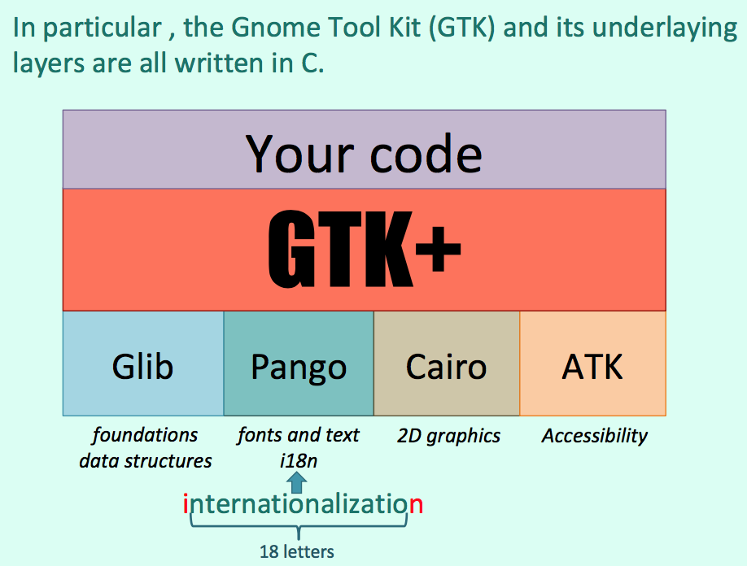
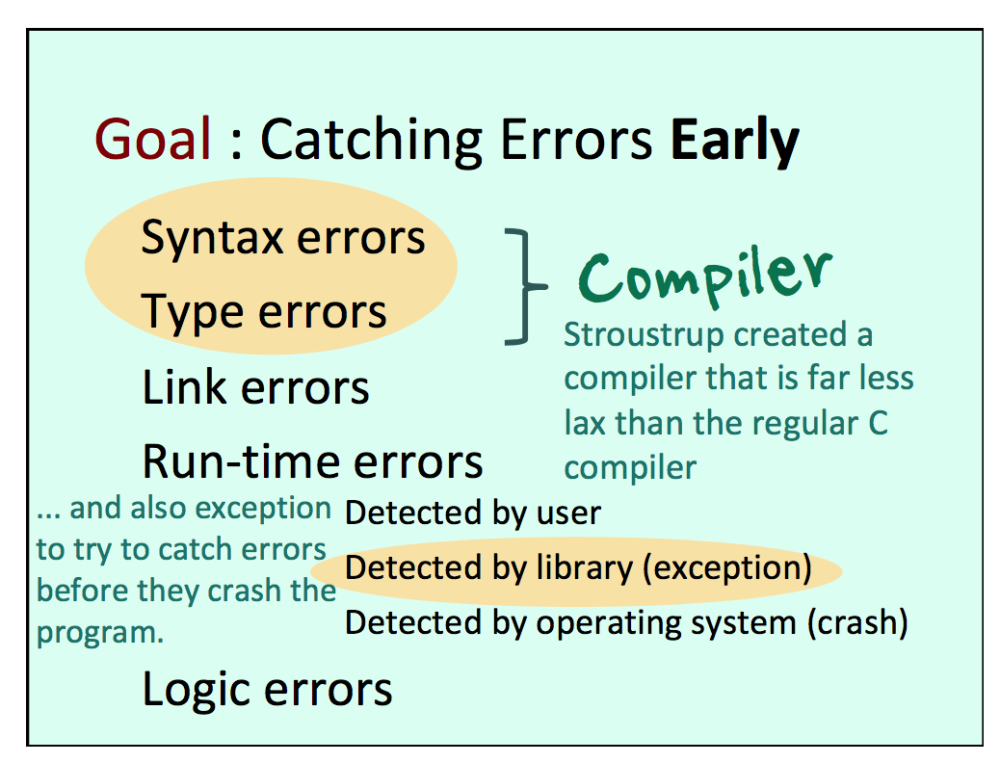

# Lecture 8

Static data and variables (typically list heads, tree roots and sometimes static arrays) are private to a file and invisible outside.

## Using C in an Object-Oriented style

Few areas are more suited to Object-Oriented programming than **Graphical User Interfaces** and **Windows managers**.

### Main Windows Managers

- GTK+
- Qt



### GTK+

GtkWidget is the "base class" of everything, containers and widgets such as labels, entry fields of buttons.

There is for everything a special "new" function that always returns a GtkWidget pointer.

When you need a specific behavior, you "cast" the GtkWidget pointer to a specific type.

```c
#include <stdio.h>
#include <gtk/gtk.h>

int main( int argc, char *argv[]) {
  GtkWidget *window;
  GtkWidget *label;

  gtk_init(&argc, &argv);

  /*
  The GTK_WINDOW() macro turns the GtkWidget pointer
  returned by gtk_window_new() into a "true" window pointer.
  It implements inheritance of a sort.
  Inheritance can be achieved by organizing structures well.
  */

  window = gtk_window_new(GTK_WINDOW_TOPLEVEL);
  gtk_window_set_title(GTK_WINDOW(window), "CS205");
  gtk_window_set_default_size(
    GTK_WINDOW(window), 230, 150);

  /*
  The Window is cast to a "container" when adding something to it,
  and to a mere "object" when associating the funtion
  that quits GTK to its "close" button.
  */

  g_signal_connect_swapped(
    G_OBJECT(window), "destroy",
    G_CALLBACK(gtk_main_quit), NULL);

  gtk_main();

  return 0;
}
```

## Source Control Systems

### Repository

Changes are recorded, and can be rolled back.

- git

## Finding Bugs

```c
printf(" ...", ...);
fflush(stdout);
```

## Static Analysis

- `gcc -Wall`
- oclint

## Dynamic Analysis

- gdb
- ddd
- Visual C++
- eclipse
- Xcode

> Valgrind works like a debugger, Electric-Fence is just a library (libefence) you link with. Your program will run far slower, but every memory access will be checked. More useful than traditional debuggers in my opinion.

- Valgrind
- Electric-Fence

# C++

Bjarne Stroustrup (1950 - )

"C with classes"

## Goal : Catching Errors Early




### SIMULA

- Kristen Nygaard (1926-2002)
- Ole-Johan Dahl (1931-2002)

> Stroustrup took many ideas from Simula, invented by two Norwegians who created all object-related concepts in the 1960s and became enormously influential.

## C++ Philosophy

- Anchored in reality
    - Solve actual problems
    - Reasonably easy to implement
    - Work alongside prior languages (eg C)
- Performance
    - No overhead due to unused features
    - No language beneath C++ other than assembly
- Developer freedom
    - Programmers free to pick their style
    - Manual override
    - Allowing a useful feature is more important than preventing possible misuse

C++ not easier than C but makes code organization easier.

## Extensions

- `.cpp`
- `.cc`

header files

- `.h` (C compatible)
- `.hpp` (usually contain class definitions)

**A C program is a valid C++ program.**

## Obvious extensions to C

```c++
// iostream can replace stdio.h
// Note that there is no extension specified
#include <iostream>

// Without this you should refer to std::cout
using namespace std;

int main() {
  int val = 3;

  // endl: '\n' for dummies, but more portable
  cout << "val = " << val << endl;
  return 0;
}
```

### Input/string type

```c++
#include <iostream>
#include <string>
using namespace std;

int main() {
  string str1;
  string str2;
  str1 = "Hello";
  cout << "Your name ? ";
  cin >> str2;
  /*
  string grows as needed
  No need to specify a length.
  malloc() and realloc() behind the scene.
  */
  str1 += " " + str2;
  cout << str1 << endl;
  return 0;
}
```

### Compile

`g++ -o myprog myprog.cpp`

`gcc -o myprog myprog.cpp –lc++`

(Standard C++ library)

### Array

```c++
#include <iostream>

#define ARRAY_SZ 10
int main() {
  int *ip;

  ip = new int[ARRAY_SZ];
  for (int i = 0; i < ARRAY_SZ; i++) {
    ip[i] = i;
  }
  /*
  Square brackets if you free an array,
  not if you free a single object
  */
  delete[] ip;
  return 0;
}
```

### Exceptions

```c++
try {
  ...
  throw exception
} catch (exception1){
  ...
} catch (exception2){
  ...
}
```

### Functions

- Overloading
- Optional parameters with default values

`int my_func(string p1, int p2=0)`

- Automatic reference

```c++
#include <stdio.h>

int safe_scanf(int& value) {
  // Note that &value is still needed.
  return scanf("%d", &value);
}

int main() {
  int val;

  printf("Enter a value : ");
  /*
  Here the address of val (in the main) is
  passed to safe_scanf() that passes it again to scanf()
  */
  safe_scanf(val);
  printf("Value: %d\n", val);
  return 0;
}
```

### CLASSES

In C++ you can have in a structure "member functions" (close to function pointers that are automatically initialized), also called "methods"

```c++
#ifndef MATRICES_HPP
#define MATRICES_HPP
struct matrix {
  short rows;
  short cols;
  double *cells;

  matrix *new_matrix(int r, int c);
  void free_matrix();
  matrix *matrix_add(matrix *m);
  matrix *matrix_scalar(double lambda);
  matrix *matrix_mult(matrix *m);
  matrix *matrix_inv();
  double matrix_det();
};
#endif
```

When actually writing the function (in another file) **you must prefix the function name by the struct name** (spoiler: same thing with classes) because you can imagine different structure containing functions with identical names (eg `length()`)

```c++
matrix *matrix::new_matrix(int r, int c) {
  ...
}
```

Turn a struct into a class

```c++
#ifndef MATRICES_HPP
#define MATRICES_HPP
class matrix {
  short rows;
  short cols;
  double *cells;

  public:
    matrix(int r, int c); // constructor
    ~matrix(); // destructor
    matrix *matrix_add(matrix *m);
    matrix *matrix_scalar(double lambda);
    matrix *matrix_mult(matrix *m);
    matrix *matrix_inv();
    double matrix_det();
};
#endif
```

Contrary to Java, the code of functions isn't usually supplied in the class definition (it can be, but this is usually only done for very simple functions that need only a few lines of code).

Code is given in other files, and each function name is given as `<class name>::<function name>` as we have seen with the struct example.

The class really is an **interface**, the specification of how you interact with the object. The source code may not be supplied in a legible form but only as a `.o` file.

### Vectors

a built-in collection similar to a Java `ArrayList`

`#include <vector>`

`vector<any type> my_list;`

`my_list[i]`

`my_list.size()`

`my_list.push_back(e)`
adds element at the end

`my_list.pop_back()`
deletes last element

`my_list.insert(pos, e)`


**No garbage collector in C++.**

In Java, an object is always a reference (always created with `new`). Not in C++, where you can either declare an object or declare a pointer and allocate the object dynamically.

`ClassType object;`

`ClassType *object;`

### Accessing attributes/methods

`.` With regular objects

`->` With object pointers

### Mixing C and C++

#### Identifying the function

In C, you identify by the **name only** and check return type and parameter type.

In C++ you identify by **name and number and types of parameters**.

We must let the C++ compiler and linker know that a function is a C function, so that the generated computer code can be adapted.

`.h` file
```c++
#ifdef __cplusplus
extern "C" {
#endif
  extern int c_func1(char *arg);
  extern double c_func2(int arg1, int arg2);
#ifdef __cplusplus
}
#endif
```


...
