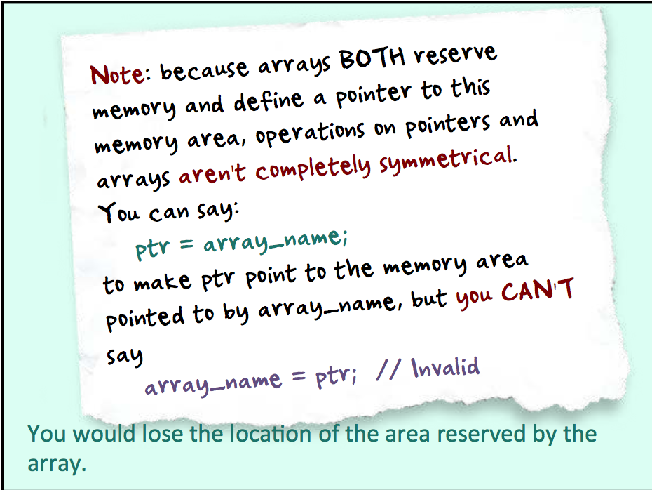
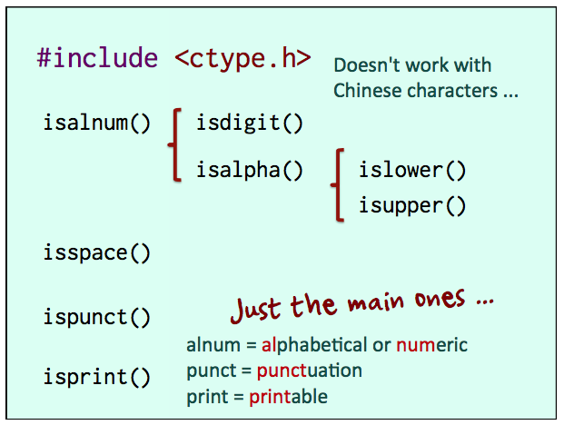
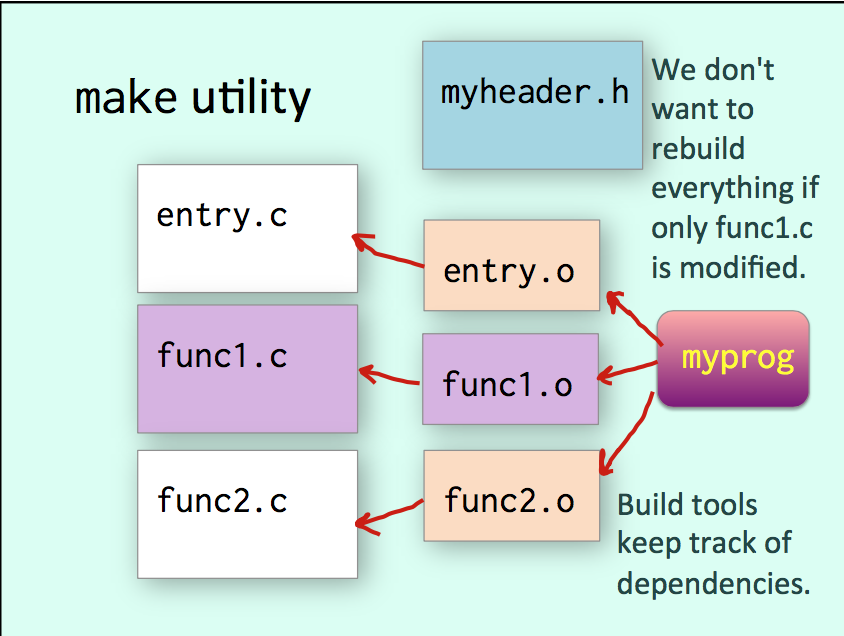
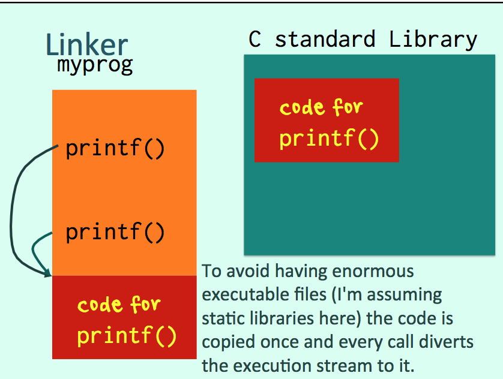
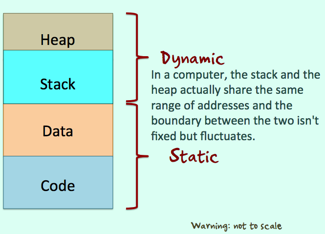
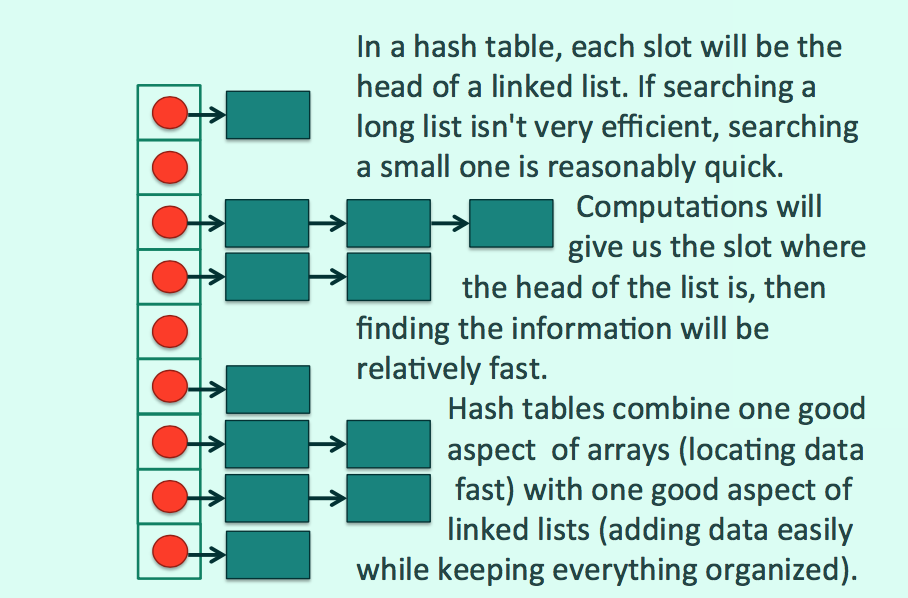
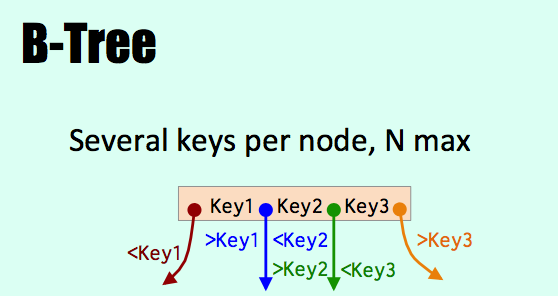

# Mid-term Exam Review

# Lecture 1

## Pointer

`ptr_my_var = &my_var`

`*ptr_my_var`

32-bit machine: 4 bytes

64-bit machine: 8 bytes

### More on Pointers (Lecture 3)

`&` returns the address of a variable

### Pointer declaration
`data_type *pointer_name`

**Declaring a pointer ONLY RESERVES MEMORY FOR THE POINTER**

> You assign to it the address of memory reserved by other means.

`int my_array[25];`
Declares two things:
1. Room to store 25 consecutive integers
2. A pointer to the first one

### `sizeof()`
returns a long

Gives the size of what was reserved. The argument can be a data type as well as a variable name. Very useful.

### NULL
Initialize pointers to a variable address or to NULL!

NULL is a constant which represents a pointer with all bits set to zero.

Functions that return a pointer return NULL when they fail or are done.

**An uninitialized pointer could hit memory anywhere!**

**A pointer holds a reference to a variable value.**

### Dereferencing `*`
`*` operator

### Pointer arithmetic
`pointer + n`

Makes the pointer point to the nth element - like array indices.

`p++`
Increments p by as many bytes as the type p points to.

`*p++`
Returns the value pointed to by p then increases p (in an assignment).

`(*p)++`
Increases by one what p points to (COMPLETELY
DIFFERENT).



> The main difference between a C array and a Java array is that when you declare a C array there is an implicit memory reservation. There is none in Java, which is why a new is required (we'll see shortly the C equivalent). Java only declare a reference, in fact.

## Data types

Data Type  |  Length (byte)
--|--
char  |  1
short  |  2
int | 4
long | 8
float | 4
double* | 8
\* Exponent 11 bits, Radix 52 bits

### Integer Operations

- Usual operators +, -, *, /
- Modulo %
- Bit operations &, |, ~
- Bit shift \>>, <<

## Array

`my_var` Value

`my_arr[n]` Value

`my_arr` Address <-> `&(my_arr[0])`

### "Out of Bound"
Anything can happen.

## String
Char array

### End-of-string marker

`'\0'` byte with all bits set to zero

```c
char my_text[6] = {'H', 'e', 'l', 'l', 'o', '\0'};
```

`'A'` One character
`"A"` Two characters <-> `{'A', '\0'}`

## Functions are not nested
All functions are at the same level.

## Compiling a C program
1. A preprocessor runs over your code
The preprocessor simply replaces text. It looks for lines that start with a `#`, which are preprocessor instructions. `#include` says to fetch a header file and insert it into the code. `#define` gives a name to a constant value. Whenever the name is found in the code, it will be replaced by the value.
1. Compiler turns the code into an "object file".
2. Linker adds the code of standard C functions and turns the program into an "executable" program.

> A compiled language is faster and uses fewer resources.

`gcc log_sample.c –o log_sample -lm`

> Libraries all have a name that starts with "lib" and therefore (because C developers like shortcuts) the name doesn't need to be given in full. If you also use functions from `libblahblah`, you'll add `-lblahblah` to your command line.

# Lecture 2

## Flow Control

### If-else
```c
if (condition) {
  instructions
} else {
  other instructions
}
```

In C, integer values (char, short, int, long) are used instead of boolean data type. `0 = false, other = true`

> Curly brackets not mandatory when conditions applies to a single instruction.

## Inequality
In the ASCII code, uppercase comes before lower case.

### Switch
```c
switch (expression) {
  /*
  Char or integer expression ONLY
  Doesn't work with float/double
  Doesn't work with arrays, including strings
  */
  case value1:
    instructions
    break;
  case value2:
    ...
  default:
    instructions
    break;
  /*
  As in Java, break exits the switch;
  without break, you fall through..
  */
}
```

### While
```c
while (condition) {
  instructions
}
```

```c
do{
  instructions
} while(condition)
```

### For
```c
for (initialization; condition; increment) {
  instructions
}
```
> In tradiJonal C, where usually all variables, even loop variables, are declared at the beginning of a function. Java behaviour is allowed in C99, which borrows it from Java.

## Error management in C
`int scanf(const char *restrict format, ...);`
It returns the number of items assigned.

### Initialization

> Some C compilers initialize bytes to 0. Others don't.

```c
#include <stdio.h>
int main() {
  printf("Enter an integer: ");
  if (scanf("%d", &n) == 1) {
    printf("The square of %d is %d\n", n, n * n);
  } else{
    printf("An integer was expected.\n");
  }
  return 0;
}
```

## Functions
> As C has no classes, no objects and no methods, C functions are similar to static functions in Java, and aren't attached to any particular variable.

**No overloading.**
> In C (NOT in C++) functions must uniquely be identified by their NAME.

> Functions must be declared before being used.

Two options
1. Define every function before you call it.
2. You put at the beginning of the file function prototypes that are just return type, name and parameters (no function body).

See **Lecture 7** for more details.

```c
#include

#include "func.h"

#define

code of functions

// Order doesn't matter

main()
```

`#include <filename.h>` looks for system header file at "well known places"

`#include "filename.h"` looks for file in the current
directory

### C Standard Library
Functions that only require a header file.

### Input/Output Functions

Three default "streams"
1. stdin
2. stdout
3. stderr

#### Unix (Linux) "pipe"
`my_program1 | my_program2` Turn the output of one program into the input of another program.

> Most "char" functions actually work with "int" (4-byte) variables that are truncated when assigned to a "char" (1-byte) variable.

```c
c = getchar();
c = fgetc(stdin);

putchar(c);
fputc(c, stdout);
```

#### fgets
For reading lines of text, use fgets() that loads data into an array the maximum size of which is provided. fgets() also loads end-of-line characters.

DON'T USE gets(). If you read more than what the array can store, you'll **corrupt memory**.

`char *fgets(char *str, int size, stdin)`

`gets(str)`

`int fputs(char *str, stream)` *

`int puts(str)` appends `\n` to the output **stdout** *

\* Return 0 if OK, EOF if error.

`scanf(format, &var)`

`printf(format, ...)` **stdout**

`fprintf(stream, format, ...)`

### Classification of characters
`#include <ctype.h>`

It contains functions (and macros) to test characters.

`int issomething(int c)`

- Returns zero if the character isn't a "something".
- Returns something different from zero if it is a "something".



`int tolower(int c);`

`int toupper(int c);`

> There isn't in standard C any funcJon to change the case of a full string (it's very easy to write).

### String manipulation

```c
#include <string.h>
```

`int strlen(char *string);` Starts from the pointer passed and moves on, counting chars until one encounters \0.

#### Unsafe basic copy/concat functions
`char *strcpy (char *dest, char *src)`

Starts at dest and copies what starts at src until `\0` is met.

`char *strcat(char *dest, const char *src)`

Starts at dest and moves on until one encounters `\0`, then copies what starts at src until `\0` is met.

**NO BOUNDARY CHECKING** Overflow. Possible memory corruption.

#### Limits to n characters at most
`char *strncpy(char *string1, char *string2, int n)`

`char *strncat(char *dest, const char *src, int n)`

**strcmp**

`int strcmp(char *string1, char *string2);`

`int strncmp(char *string1, char *string2, int n);`

- Returns 0 if equal.
- <0 is string1 comes alphabetically before string2
- \>0 is the reverse is true

> Both strcmp() and strncmp() are safe if strings are terminated with `\0`.

**Ignore case**

`int strcasecmp(char *string1, char *string2);`

`int strncasecmp(char *string1, char *string2, int n);`

**Search strings**

`char *strchr(char *string, int c);` Returns NULL if nothing found.

`char *strrchr(char *string, int c);` Searches from the end.

`char *strstr(char *string, char *substring);`

`char *strtok(char *string, char *separators);`

## Chinese Characters
`#include <wchar.h>`

wchar_t is a type that extends char and handles multi-byte
characters.

wide char = character stored on several bytes

`fwprintf()`
`fgetws()`
`wcslen()`
`wcscpy()`

`setlocale(LC_ALL, "zh_CN.UTF-8");`

### Unicode
4-byte (provision for 6) codepoint

# Lecture 3

### GB2312
Succeeded by GBK

GB2312/GBK can encode close to 9,000 characters on two bytes.

### UTF-8
In UTF-8 (most used on the web) 1 to four characters can be used. The first bit(s) of the first byte tells how many bytes compose the character. Continuation bytes always have the left-most bit set to 1.

- 1 byte for basic Latin
- 2 bytes for Europe, Middle Ease
- 3 bytes for Asia
- 4 bytes for weird languages

> It's not as space-efficient as specialized encoding, but it's compatible with most of what pre-existed, the source code of computer programs in particular.

### String conversion
`#include <stdlib.h>`

Old fashioned functions

`int atoi(char *str);` `long atol(char *str);` `doubleatof(char*str);`

Better to use `strtol()` `strtod()`

## Error Handling
`#include <errno.h>`

`int errno` Global variable

Set by all system calls - reset to 0 by all successful system calls

`char *strerror(int errnum )`

Returns the text of the associated
error message

`perror("your message" + strerror(errno));`

## Time functions

`#include <time.h>`

`time_t clock;` "time type" (integer)

Dates are stored as the number of seconds since the "epoch"

> **epoch**: January 1st, 1970, 00:00:00

`clock = time(NULL);`
current day and time

`printf("%s", ctime(&clock));`
carriage return `\n` included in what `ctime()` returns

```c
#include <stdio.h>
#include <time.h>
int main() {
  time_t clock;
  clock = (time_t)0;
  printf("%s", ctime(&clock));
  return 0;
}
```

### Struct tm
Struct tm is defined in time.h and breaks up a date/time into its components..
```c
struct tm {
  int tm_sec;     /* seconds (0 - 60) */
  int tm_min;     /* minutes (0 - 59) */
  int tm_hour;    /* hours (0 - 23) */
  int tm_mday;    /* day of month (1 - 31) */
  int tm_mon;     /* month of year (0 - 11) */
  int tm_year;    /* year - 1900 */
  int tm_wday;    /* day of week (Sunday = 0) */
  int tm_yday;    /* day of year (0 - 365) */
  int tm_isdst;   /* is summer time in effect */
  char *tm_zone;  /* abbreviation of timezone name */
  long tm_gmtoff; /* offset from UTC in seconds */
};
```
Two functions take a pointer to a time_t (number of seconds to 1/1/1970 at 00:00:00) and return a pointer to a struct tm.

`struct tm *localtime(const time_t *clock);`

`struct tm *gmtime(const time_t *clock);`

\* Returns NULL if error.

Two functions take a pointer to a struct tm and return the corresponding number of seconds since 1/1/1970 at 00:00:00.

`time_t  mktime(struct tm *timeptr);`

`time_t  timegm(struct tm *timeptr);`

\* Returns -1 if error.

## `random()`


`#include <stdlib.h>`

`long random(void)` means "no parameter"

`srandom(unsigned long seed)`

### Random number between a and b
`num = (data type)(a + (b – a) * random() / (double)RAND_MAX);`

### Random integer between 0 and n - 1
`num = random() % n;`

## Localization

`#include <locale.h>`

`setlocale(LC_ALL, "zh_CN.UTF-8");`

> It affects some time functions (because date formats differ by country), but not ctime().

## Arrays of Strings

`char *simple_string = "A string";`

`char *string_array[] = {"Welcome", "Bienvenidos", "Bienvenue", "Willkommen", "Bemvindos", NULL};`

> If you let the compiler compute the size, you should have a NULL to know where the array stops when you loop.

> Another method is to use function sizeof() to get the size of the array and divide by the size of one element, here a char *

`char **string_array = {"Welcome", "Bienvenidos", "Bienvenue", "Willkommen", "Bemvindos", NULL};`

A multi-dimensional array can also be given explicit sizes:

`double matrix[ROW_COUNT][COL_COUNT]`

## Command line parameters

```c
int main(int argc, char *argv[]) {
  /*
  argc is always at least 1,
  argv[0] always contains the name of the program
  */
}
```

`getopt()` for managing flags passed to commands

## Structures
Structures are like objects with only atributes and no methods. Everything is public.

**(nameless) user-defined data type**
```c
struct {
  char place_name[NAME_LEN];
  double latitude;
  double longitude;
} my_place;
strncpy(my_place.place_name, "Shenzhen", NAME_LEN);
my_place.latitude = 22.25;
my_place.longitude = 114.1;
```

```c
struct {
        char   place_name[NAME_LEN];
        double latitude;
        double longitude;
      } my_place = {"Shenzhen",
                      22.25,
                      114.1};
```

### Naming a Structure
Two ways

```c
...
struct my_struct {
  char place_name[NAME_LEN];
  double latitude;
  double longitude;
};
/*
  Declaration is like an instantiation
  but there is no new here (important)
*/
int main() {
  struct my_struct my_place;
  ...
}
```

```c
...
typedef struct my_struct {
  char place_name[NAME_LEN];
  double latitude;
  double longitude;
} PLACE_T;
// typedef gives a user-defined name to the structure
int main(){
  PLACE_T my_place;
  ...
}
```

`typedef int my_type;` typedef can be used with any data type.

**Structures aren't necessarily "packed".**

> There may be additional (unused) bytes in the structure.

### Alignment
Depends on architecture (i.e. type of computer).

Some computers want everything to start at even addresses, so there may be "padding"

**Don't rely on pointer arithmetic to point to the various components of a structure.**

### Dereferencing

Use the "arrow notation" with a pointer to a structure.

`ptr->place_name`
`ptr->latitude`
`ptr->longitude`

`struct_variable.fieldname`

`pointer_to_struct->fieldname`

## Union `union`

```c
union {
  long a_long;
  int an_int;
  float a_float;
} stuff;
```

In a union, all components are using the same storage in memory. Reserved size is the size of the biggest.

# Lecture 4

## FILES

### Stream redirecEon
`$ my_program < input_file`

`$ my_program > output_file`

### `FILE` Structure

`#include <stdio.h>`

> A file pointer is a stream exactly like stdin or stdout. In fact, wherever you can use stdin or stdout, you can replace them with a file pointer.

```c
FILE *fp;
if ((fp = fopen(file_name, mode)) != NULL) {
  ...
  fclose(fp);
}
else{
  perror(file_name);
  return 1;
}
```

#### `mode`
- `"r"` read
- `"w"` write
- `"r+"` read and write
- `"a"` append
- `"b"` binary, often no effect

#### Writing to a text file
`fprintf(fp, "Hello %s\n", name);`

`fputs(message, fp);`

Returns EOF on error, otherwise > 0.

#### Writing/reading any type of file
`c = fgetc(fp);`

`fputc(c, fp);`

#### Writing to / reading from a binary file
Dumping memory to a file

`fwrite(ptr, unitary_size, num_elem, fp);`

`fread(ptr, unitary_size, num_elem, fp);`

Return number of elements written/read.

#### ERROR or end of file
`feof(fp);`

`ferror(fp);`

#### Same-sized structures

Index  |
--|--
Record  |
Record  |

`fseek(fp, offset, origin)`

`origin`
- `SEEK_SET` from beginning
- `SEEK_CUR` from current
- `SEEK_END` from end

### Other File Operations

`unlink()` delete a file

`flock()` check multiple accesses

### Directory Operations

`#include <dirent.h>`

`opendir()`
open a directory

`readir()`
read directory entries (struct)

`closedir()`
close the directory

## Make



### Makefile

> When you have long lines, you must terminate them with a backslash `\` followed by NOTHING, not even a space. It indicates that the next line is the continuation of the current one.

```makefile
CFLAFS = -Wall
LIBS = -lm
all: myprog
myprog: entry.o func.o func2.o
  (TAB)  gcc -o myprog entry.o func1.o func2.o $(LIBS)
%.o: %.c
  (TAB)  gcc ($CFLAGS) -c $< -o $@
clean: // make clean
  (TAB)  -rm myprog // Minus sign: if it failes, continue.
  (TAB)  -rm *.o
```


```c
...
myprog: entry.o func.o func2.o
  (TAB)  gcc -L. -o myprog entry.o -lmine $(LIBS)
%.o: %.c
  (TAB)  gcc ($CFLAGS) -c $< -o $@
libmine.a: func1.o func2.o
  (TAB)  ar -rs libmine.a func1.o func2.o
clean: // make clean
  (TAB)  -rm myprog // Minus sign: if it failes, continue.
  (TAB)  -rm *.o
  (TAB)  -rm *.a
```
> The additional flag -L is for the linker only, and says to also look into the specified directory for libraries.


### Shared Library

Extensions  | Platform
--|--
.so  | Linux
.dll  | Windows
.dylib  | OS X

## `static` and `extern` functions
`static` $\approx$ private

`extern` $\approx$ public

- `static` functions in C can only be called by functions in the same `.c` file. They are invisible to the linker, that won't find them.
- Functions that are declared as `extern` (the default) ARE findable by the linker.

```
$ nm -a module.o
$ nm -g module.o
$
```



## Stack

von Neumann Architecture  |
--|--
Heap |
Stack |
Data |
Code |

Parameters modified in a function don't affect the caller. Only the returned value is known by the caller.

```c
char *initcap(char *input) {
  char output[MAX_LEN];
  int i = 0;
  char not_after_letter = 1;
  if (input != NULL) {
    while (input[i] != '\0') {
      ...
      i++;
    }
    output[i] = '\0';
    return output;
  }
  return NULL;
}
```

4 solutions:

### 1. Transmit pointers
```c
void initcap(char *input, char *output) {
...
}
```

`scanf("%d", &my_int);`

### 2. Global variables

> Global variables are reserved for the whole life- span of the program.

```c
char G_output[MAX_LEN];
char *initcap(char *input) {
  ...
}
```

#### Drawbacks

1. Side-effects of other functions
2. Can be "hidden" by a similarly named local variable
3. Multi-threading (advanced!)

### 3. Static variables

#### `static`

- For variables, it means that they are stored in a memory area that is reserved by the compiler and will be there as long as the program is running. (in `Data`)
- For variables and functions it also means "private" to the file.



```c
char *initcap(char *input) {
  static char output[MAX_LEN];
  ...
}
```

#### Drawbacks
1. Too many may waste a lot of memory
2. Multi-threading (advanced!)


### 4. Dynamic memory

#### Memory allocation

> Java has a built-in garbage collector that cleans up the mess after you. In C and C++ you must do it yourself.

# Lecture 5

### Four main functions to know

#### `#include <stdlib.h>`

`void * malloc(size_t size);`

Returns start address or NULL.

`void * realloc(void *ptr, size_t size);`

`void free(void *ptr);`

takes a pointer to a memory chunk in the heap and releases it. Note that it doesn't reset the pointer itself; you should do it.

**You can only free memory that you have allocated.**

```c
free(p);
p = NULL;
```

**Memory Leak**
When you free memory, you mustn't leave cleaning half done.


#### `#include <string.h>`

`char*strdup(char*str);`

#### `void *` = address of "something"
- type unknown
- size unknown
- **Must cast!**

```c
char *initcap(char *input){
  if ((input != NULL)
    && (output = (char *)malloc(strlen(input) + 1) != NULL)){
      ...
    }
    ...
    return output;
  ...
  return NULL;
}
```

**What is ALLOCATED must be FREED when you no longer need it.**

Managing memory dynamically allows for great flexibility. You are no longer constrained by predefined constants.

```c
typedef struct matrix {
  short rows;
  short cols;
  double *cells;
} MATRIX_T;

MATRIX_T *new_matrix(short r, short c) {
  MATRIX_T *m = NULL;
  // WARNING: no error checking !
  m = (MATRIX_T *)malloc(sizeof(MATRIX_T));
  m->rows = r;
  m->cols = c;
  m->cells = (double *)malloc(sizeof(double) * r * c);
  return m;
}
```

```c
void free_mat(MATRIX_T *m) {
  if (m) {
    if (m->cells) {
      free(m->cells);
    }
    free(m);
  }
}
```

By passing a `pointer to a pointer`, you can even reset the pointer in the function.
```c
void free_mat(MATRIX_T **mp) {
  if (mp && *mp) {
    if ((*mp)->cells) {
      free((*mp)->cells);
    }
    free(*mp);
    *mp = NULL;
  }
}
```

### Review

1. Whatever you do in a computer, you need to reserve bytes to store your data

    * declaration -> data / stack

    * dynamic allocation -> heap

2. Dynamic allocation requires declaring pointers

```c
// declaration
STRUCT_T *strp = NULL;
// dynamic allocation
strp = (STRUCT_T *)malloc(sizeof(STRUCT_T));
```

3. ANYTHING can be declared either way

```c
// declaration
int my_int = 0;
STRUCT_T struct_var;
// dynamic allocation
int *intp = (int *)malloc(sizeof(int));
STRUCT_T *strp = (STRUCT_T *)malloc(sizeof(STRUCT_T));
```

4. Arrays are memory + pointer
5. You can mix arrays and pointers
6. You copy values on the stack when calling funcDons
    - Simple variable
    - Full structure
    - Address (pointer, array)
7. To modify a parameter, you need to pass its address
> You can say that a pointer is "const" if the function doesn't modify it.

`int printf(const char *fmt, ...)`

## Recursion

A function contains a call to itself (with other parameters).

There will necessarily be a condition in the function to stop the recursion.

### Quick Sort
Tony Hoare

```c
int place_pivot(int *arr, int elem_count) {
  int pivot;
  int tmp;
  int up = 1;
  int down = elem_count - 1;

  pivot = arr[0];
  while (down > up) {
    while ((arr[up] <= pivot) && (up < down)) {
      up++;
    }
    while ((arr[down] > pivot) && (up < down)) {
      down--;
    }
    if (up < down) {
      // Exchange values
      tmp = arr[up];
      arr[up] = arr[down];
      arr[down] = tmp;
    }
  }
  // up has stopped at a value > pivot
  // or when it met the down pointer
  if (pivot < arr[up]) {
    // Place pivot at up - 1
    up--;
  }
  arr[0] = arr[up];
  arr[up] = pivot;
  return up;
}
```

```c
void quicksort(int *arr, int elem_count) {
  int limit;
  int tmp;

  switch (elem_count) {
    case 0:
    case 1: // Do nothing
      break;
    case 2:
      if (arr[1] < arr[0]) {
        tmp = arr[1];
        arr[1] = arr[0];
        arr[0] = tmp;
      }
      break;
    default:
      limit = place_pivot(arr, elem_count);
      // Now recursion
      quicksort(arr, limit);
      quicksort(&(arr[limit+1]),elem_count-limit-1);
      break;
  }
}
```

**Don't use recursion where loops are easy to write.**

# Lecture 6

## Data Structures

`realloc()`

- It looks like for a free, big enough memory area in the heap that can be assigned to you and reserves it.
- It then uses the original pointer to copy what was at the old place to the new place, then it frees the old place before returning to your program the address of the new one.

### Sorting

Data is easier to find when ordered.

```c
// Name becomes mandatory as the compiler reads lines in order.
struct place {
  char *place_name;
  double latitude;
  double longitude;
  struct place *next;
} PLACE_T;
```

### Linked List

```c
typedef struct place_list {
  PLACE_T *first_element;
  int place_count;
} PLACE_LIST_T;
```

- Easy to add a node at the right place
- Easy to remove a node

```c
PLACE_T *new_place(char *place_name,
                    double latitude,
                    double longitude) {
  PLACE_T *p = NULL;
  if (place_name) {
    if ((p = (PLACE_T *)malloc(sizeof(PLACE_T))) != NULL) {
      p->place_name = strdup(place_name);
      p->latitude = latitude;
      p->longitude = longitude;
      p->next = NULL;
    }
  }
  return p;
}
```

```c
void insert_place(PLACE_T **head_ptr, PLACE_T *place) {
  PLACE_T *p;
  PLACE_T **prev_ptr = NULL;
  if (head_ptr != NULL) {
    if ((p = *head_ptr) == NULL) {
      *head_ptr = place;
    } else {
      prev_ptr = head_ptr;
      while (p &&
        (strcmp(place->place_name, p->place_name) > 0)) {
        prev_ptr = &(p->next);
        p = p->next;
      }
      place->next = p;
      *prev_ptr = place;
    }
  }
}
```


```c
void insert_place(PLACE_T **head_ptr, PLACE_T *place){
  if (head_ptr != NULL){
    if (*head_ptr == NULL){
      *head_ptr = place;
    } else{
      if (strcmp(place->place_name, (*head_ptr)->place_name) > 0)){
        insert_place(&((*head_ptr)->next), place);
      } else {
        place->next = *head_ptr;
        *head_ptr = place;
      }
    }
  }
}
```

```c
void show_places(PLACE_T *p) {
  if (p) {
    printf("%s (%lf, %lf)\n", p->place_name,
                              p->latitude,
                              p->longitude);
  }
}
```

```c
void delete_places(PLACE_T **p_ptr) {
  if ((p_ptr != NULL) && (*p_ptr != NULL)){
    delete_places(&((*p_ptr)->next));
    free((*p_ptr)->place_name);
    free(*p_ptr);
    *p_ptr = NULL;
  }
}
```

### Hash Table

- Make storage location dependent on value.
- Ordering is relative.
- Make location absolute.



### Trees

Data structures made for recursion.

```c
typedef struct place {
  char *place_name;
  double latitude;
  double longitude;
  struct place *left;
  struct place *right;
} PLACE_T;
```

```c
PLACE_T *new_place(char *place_name,
                    double latitude,
                    double longitude) {
  PLACE_T *p = NULL;
  if (place_name) {
    if ((p = (PLACE_T *)malloc(sizeof(PLACE_T))) != NULL) {
      p->place_name = strdup(place_name);
      p->latitude = latitude;
      p->longitude = longitude;
      p->left = NULL;
      p->right = NULL;
    }
  }
  return p;
}
```

```c
void insert_place(PLACE_T **root_ptr, PLACE_T *place) {
  PLACE_T *p = NULL;
  if (root_ptr != NULL) {
    if ((p = *root_ptr) == NULL) {
      *root_ptr = place;
    } else {
      if (strcmp(place->place_name, p->place_name) > 0) {
        insert_place(&(p->right), place);
      } else {
        if (strcmp(place->place_name, p->place_name) < 0) {
          insert_place(&(p->left), place);
        }
      }
    }
  }
}
```

```c
void show_places(PLACE_T *p) {
  if (p) {
    show_places(p->left);
    printf("%s (%lf, %lf)\n", p->place_name,
                              p->latitude,
                              p->longitude);
    show_places(p->right);
  }
}
```

```c
void delete_places(PLACE_T **p_ptr){
  if ((p_ptr != NULL) && (*p_ptr != NULL)){
    delete_places(&((*p_ptr)->right));
    delete_places(&((*p_ptr)->left));
    free((*p_ptr)->place_name)
    free(*p_ptr);
    *p_ptr = NULL;
  }
}
```

### AVL Tree

#### Balance Factor
(Height of left subtree) – (Heigh of right subtree)

-1, 0, 1 are OK.

If the new node brings an imbalance of two levels, then you must **rotate** the tree.

# Lecture 7

### B-Tree

Several keys per node, N max.



## Pointers on Functions

```c
int (*comp)(void *, void *);
comp = strcmp;
int cmp = (*comp)(p1, p2);
int cmp = comp(p1, p2);
// The two statements are equivalent
```
`(*comp)`

> As a side note, you can define in a structure an aaribute that is a pointer to a function. In fact, you can have many such pointers in a structure, and assign to them the address of existing functions when you initalize your structure.

> At this point, your function pointers are beginning to look a lot like methods ... This is how C became C++ and **object-oriented**, as we shall see later.

## Functions available in C

BSD System

`#include <search.h>`

```c
typedef struct entry {
                    char    *key;
                    void    *data;
                   } ENTRY;
```

```c
int  hcreate(size_t nel);
void hdestroy(void);
ENTRY *hsearch(ENTRY item, ACTION action);
```

> These ENTRY items can be used with hash tables.

```c
void *tsearch(const void *key, void **rootp,
               int (*compar) (const void *key1,
                              const void *key2));
void twalk(const void *root,
            void (*action) (const void *node,
                  VISIT order, int level));
```

### B-tree functions

```c
#include <sys/types.h>
#include <db.h>
```

### GLib

The open-source GNU library contains many functions for managing data structures.

> It's often easier to write one's own custom functions than to use generic ones.

## Comparing Data Structures

- Arrays
- Linked Lists
- Hash Tables
- Trees

> Think of **in-memory databases** too.

## Organizing Your Code

```c
#include

#include "func.h"

#define

/*
  1. Constant value
  2. "Flag" name to avoid multiple inclusions
  3. Macros
*/

#ifndef / #ifdef

#else

#endif


code of functions

// Order doesn't matter

main()
```

```c
#ifndef MATRICES_H
#define MATRICES_H // No value required
typedef struct matrix {
  short rows;
  short cols;
  double *cells;
} MATRIX_T;

MATRIX_T *new_matrix(int rows, int cols);
void free_matrix(MATRIX_T *m);

MATRIX_T *matrix_add(MATRIX_T *m1, MATRIX_T *m2);
MATRIX_T *matrix_scalar(MATRIX_T *m, double lambda);
MATRIX_T *matrix_mult(MATRIX_T *m1, MATRIX_T *m2);
MATRIX_T *matrix_inv(MATRIX_T *m);
double matrix_det(MATRIX_T *m);
#endif
```

## Macros

Afer preprocessing, the macro will be simply replaced by it's definition. "parameters" are replaced by the actual values.

```c
#define _max(a, b) (a > b ? a : b)
...
maxval = _max(val1, val2);
// maxval = (val1 > val2 ? val1 : val2);
...
```

> As it's pure text replacement, always enclose your macro between parentheses to avoid unwanted side-effects.

Macros can include blocks between curly brackets and be on several lines.
```c
#define _init(some_struct) { \
  some_struct.a = 0; \
  some_struct.b = 0; \
  some_struct.str = ""; }
```

### Difference between macros and functions

- Macros are just substituTon.
- No call.
- No copy of arguments.
- Operating directly on variables.

## Useful Predefined Variables

### `__FILE__`
ontains the name of the current .c file.

### `__LINE__`
the current line number in the file.

## Conditional Compiling
All environments have at least one preprocessor symbol that is only defined in them.
[Full List](hap://sourceforge.net/p/predef/wiki/OperaTngSystems/)

```c
#include <stdio.h>
int main() {
  #ifdef _WIN32
    printf("I'm running on Windows\r\n");
  #endif
  #ifdef __APPLE__
    printf("I'm running on a Mac\n");
  #endif
  #ifdef __linux__
    printf("I'm running on Linux\n");
  #endif
  return 0;
}
```

## The GNU build system
### "Autotools"

#### Using it
```
$ configure
$ make
$ make install
$
```

#### Preparing it
Packaging your project is tougher. A tool named "autoscan" analyses the source files and generate a "configure.scan", that you must inspect and possibly modify before renaming it "configure.ac".

`autoscan [<directory>]`

You must also manually prepare a "makefile.in" (for bigger projects you can have a top-level "Makefile.am").

"autoconf" prepares "configure", and "configure" uses makefile.in to
generate the final Makefile that will buid the program. Other tools such as automake can be used in the process. As you see, simplicity for the end-user is at the expense of complexity for the developer.

Other tools: Cmake

## Global Vriables

Don't use extern variables. Truly global variables are evil.

In C, your static global variables should be limited to variables such as
- global flags
- references to collections, such as heads of lists or tree roots.
- file pointers, network sockets, database connections, and so forth.

**BEWARE when the code is shared between threads!**

With threads, global variables are usually pointers.


...
